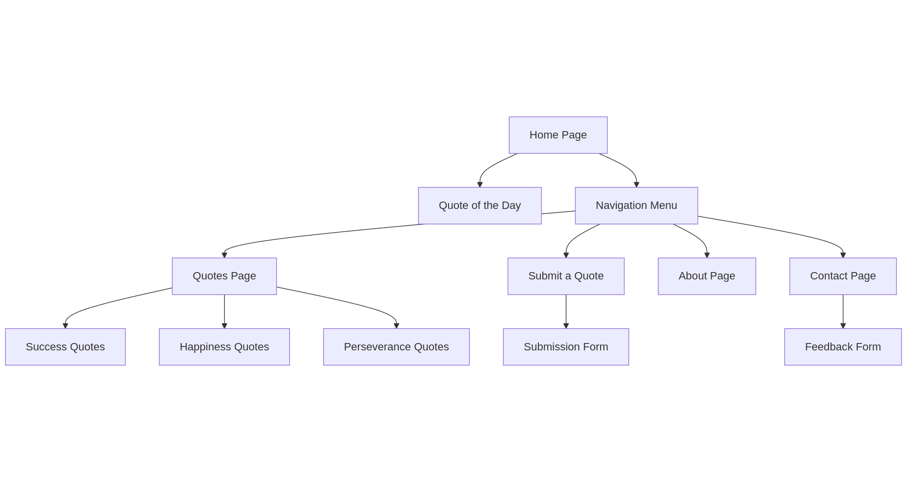
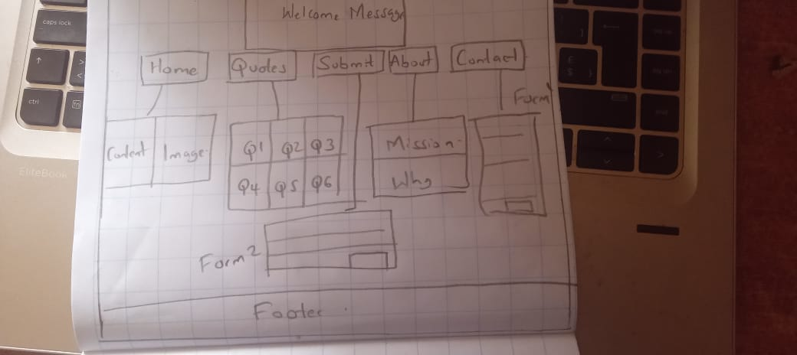

<!DOCTYPE html>
<html lang="en">
<head>
    <meta charset="UTF-8">
    <meta name="viewport" content="width=device-width, initial-scale=1.0">
    <title>Website Project Proposal - InspireHub</title>
    
</head>
<body>
    <header>
        <h1>InspireHub – A Motivational Quote Website</h1>
    </header>

    

        <section id="project-concept">
            <h2>1. Project Concept</h2>
            <h3>Overview:</h3>
            

                InspireHub is a motivational website designed to provide users with daily inspiration through well-curated quotes from famous figures. The website will have five distinct pages, each serving a unique purpose while maintaining a user-friendly experience.
            

            <h3>Objectives & Goals:</h3>
            <ul>
                <li>To create an aesthetically pleasing and accessible platform for motivational quotes.</li>
                <li>To enable users to browse quotes based on themes such as success, perseverance, and wisdom.</li>
                <li>To provide an intuitive user experience with seamless navigation.</li>
                <li>To allow users to submit their favorite quotes for potential inclusion.</li>
            </ul>
            <h3>Target Audience:</h3>
            <ul>
                <li>Students looking for motivation.</li>
                <li>Professionals needing daily encouragement.</li>
                <li>General users interested in wisdom and personal growth.</li>
            </ul>
            <h3>Key Features:</h3>
            <ul>
                <li>A homepage showcasing a featured quote of the day.</li>
                <li>A categorized quote collection.</li>
                <li>A submission page for users to share their favorite quotes.</li>
                <li>An about page explaining the mission of InspireHub.</li>
                <li>A contact page with a feedback form.</li>
            </ul>
        </section>

        <section id="site-map">
            <h2>2. Site Map</h2>
            
The website consists of the following five main pages:

            <ul>
                <li><strong>Home</strong> – Displays the quote of the day with an elegant design.</li>
                <li><strong>Quotes</strong> – A categorized collection of quotes (e.g., Success, Happiness, Resilience).</li>
                <li><strong>Submit a Quote</strong> – A form where users can submit their favorite quotes.</li>
                <li><strong>About</strong> – Information about the mission and purpose of the website.</li>
                <li><strong>Contact</strong> – A simple form for users to send feedback or inquiries.</li>
            </ul>
            <h3>Visual Representation of the Site Map:</h3>
            
        </section>

        <section id="wireframe">
            <h2>3. Wireframe</h2>
            <h3>Homepage Wireframe:</h3>
            
A well-structured wireframe for the homepage includes the following elements:

            <ul>
                <li><strong>Header:</strong> Site logo and navigation menu.</li>
                <li><strong>Main Content:</strong> Quote of the day, author’s name, and a share button.</li>
                <li><strong>Sidebar:</strong> Categories for quick browsing (e.g., Success, Love, Wisdom).</li>
                <li><strong>Footer:</strong> Links to the About and Contact pages.</li>
            </ul>
            <h3>Visual Representation of the Wireframe:</h3>
            
        </section>

        <section id="resource">
            <h2>Resource:</h2>
            
For more details on how to create wireframes and site maps, here is a helpful guide:

            
Check out <a href="https://www.mockflow.com/" target="_blank" class="resource-link">MockFlow Wireframe Tool</a> for creating more detailed wireframes and site maps.

        </section>
    

    <footer>
        
&copy; 2025 InspireHub. All rights reserved.

    </footer>
</body>
</html>
